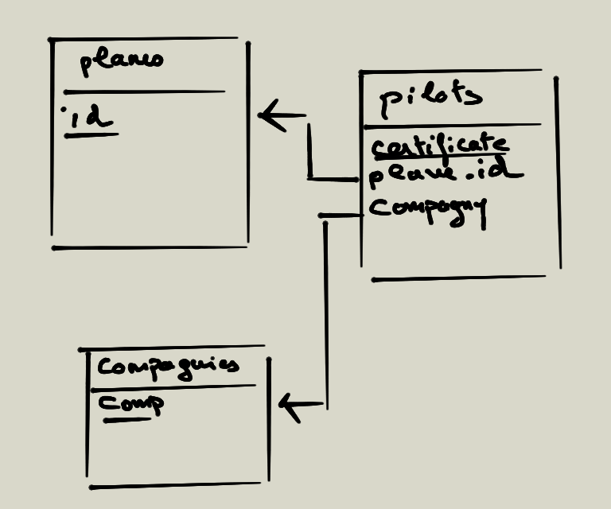

# Refactorisation du modèle de données

Nous allons créer un autre modèle de données dans la base de données db_aviation.

La relation que nous allons mettre en place est la même que celle que nous avons vue entre la table pilots et compagnies. C'est une relation 1:N.

- Un pilot est associé à au plus un unique avion de 0 à 1.
- Un avion peut avoir de 0 à N pilotes.

Nous allons voir les clés auto-incrémentées. Elles sont très pratiques. Nous n'avons pas à nous en soucier, car elles sont automatiquement mises à jour par MySQL lors de l'insertion (nouvelle enregistrement dans la table). Lors de la suppression d'un enregistrement l'index de la valeur des clés est mémorisé. Les prochains enregistrements partiront du dernier index connu par MySQL. Notez également que les index numériques partent de la valeur entière 1.

Considérez le schéma suivant :



Créez la table planes avec les colonnes suivantes :

- id PK de type INT UNSIGNED AUTO INCREMENT

- name CHAR(5)

- description type TEXT

- numFlying type DECIMAL(8,1)

Vous insererez les données suivantes dans la table planes :

```text
+----+------+--------------------------------+-----------+
| id | name | description                    | numFlying |
+----+------+--------------------------------+-----------+
|  1 | A380 | Gros porteur                   |   12000.0 |
|  2 | A320 | Avion de ligne quadriréacteur  |   17000.0 |
|  3 | A340 | moyen courrier                 |   50000.0 |
+----+------+--------------------------------+-----------+
```

Créez maintenant la clé étrangère plane_id dans la table pilots. Cette clé est exactement du même type que la clé primaire de la table planes.

```sql
ALTER TABLE `pilots`
ADD CONSTRAINT `fk_pilots_planes`
FOREIGN KEY (`plane_id`) REFERENCES `planes`(`id`);
```

Insérez et mettez à jour les tables planes et pilots, voyez les sources sur la plateforme.

```sql

INSERT INTO `planes`
 (`name`, `description`, `numFlying`)
VALUES
('A320', 'Avion de ligne quadriréacteur', 17000.0),
('A340', 'Moyen courier', 50000.0),
('A380', 'Gros porteur', 12000.0);

UPDATE `pilots`
SET `plane_id` = 1
WHERE `plane` = 'A320';

UPDATE `pilots`
SET `plane_id` = 2
WHERE `plane` = 'A340';

UPDATE `pilots`
SET `plane_id` = 3
WHERE `plane` = 'A380';

```

Supprimez maintenant la colonne plane dans la table pilots, elle n'est plus utile.

## Rappels sur les contraintes référentielles

Le principe dernière ces contraintes est : **garder la base de données dans un état cohérent**.

Lorsque vous définissez une relation entre une clé primaire et une clé étrangère vous aurez les contraintes suivantes :

- Vous ne pouvez pas ajouter ou modifier dans la table pilots une référence d'avion qui n'existe pas dans la table planes.

- Vous ne pouvez pas supprimer une référence dans la table planes qui existe dans la table pilots.

### Option sur la suppression SET NULL

Si le champ plane_id peut-être NULL alors vous pouvez définir la suppression SET NULL dans la relation :

```sql
ALTER TABLE pilots
ADD CONSTRAINT fk_pilots_planes
FOREIGN KEY (`plane_id`) REFERENCES planes(`id`)
ON DELETE SET NULL;
```

Comment cela va-t-il fonctionner ? Et bien par exemple, si vous supprimez l'avion A320 dans la table planes, alors MySQL remplacera toutes les références dans la table pilots par la valeur NULL, le type plane_id doit donc être possiblement NULL.

## Relation N:N

Nous voulons créez une table trips. Elle contiendra les colonnes suivantes. Choisissez le type de ces champs en fonction de ce qu'ils représentent :

- id INT UNSIGNED PK
- name
- departure
- arrival

## 01 Exercice écrire les relations

Vous allez essayer d'écrire les relations entre la table pilots et trips en phasant des phrases en français pour expliciter leurs cardinalités.

## 02 Exercice schéma

Faites un schéma sur papier, type UML, pour expliciter la relation entre les tables pilots et trips.

## 03 Exercice passer au code

Implémentez le code pour rendre effectif votre représentation des relations dans MySQL.

*Vous prendrez soin de rendre les couples uniques dans vos tables de relations.*

## ajoutez des enregistrements

Vous allez maintenant ajouter les enregistrements suivants (voir les sources sur la plateforme):

```sql
INSERT INTO `trips`
 (`name`, `depature`, `arrival`, `created`)
VALUES
('direct', 'Paris', 'Brest',  '2020-01-01 00:00:00'),
('direct', 'Paris', 'Berlin',  '2020-02-01 00:00:00'),
('direct', 'Paris', 'Barcelone',  '2020-08-01 00:00:00'),
('direct', 'Amsterdan', 'Brest',  '2020-11-11 00:00:00'),
('direct', 'Alger', 'Paris',  '2020-09-01 00:00:00'),
('direct', 'Brest', 'Paris',  '2020-12-01 00:00:00');

INSERT INTO `pilot_trip`
(`certificate`, `trip_id`)
VALUES
('ct-10', 1),
('ct-6', 2),
('ct-100', 1),
('ct-11', 3),
('ct-12', 4),
('ct-10', 4),
('ct-12', 5);
```

## 04 Exercice les pilotes sans trajet

Quels sont les pilotes qui n'ont pas de trajet ?

## 05 Exercice trajet des pilotes

Sélectionnez les trajets de tous les pilotes.

## 06 Exercice sauvegarde de la base de données

Pour terminer faite un dump de votre base de données puis importez celui-ci dans phpMyAdmin en créant une base de données db_aviation_analyst

```bash
mysqldump -u root -p db_aviation > dump_aviation_analyst.sql
```
